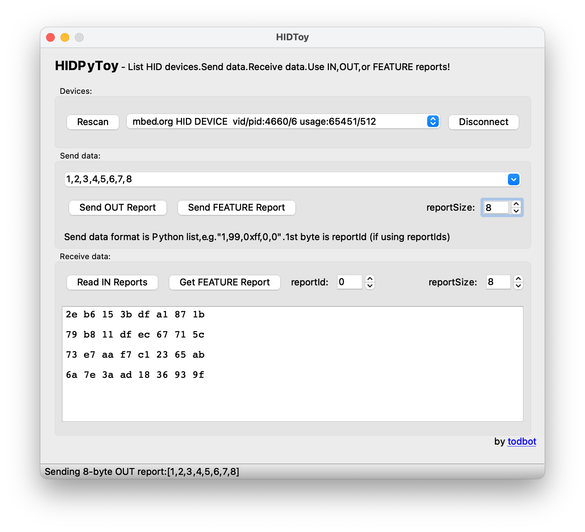
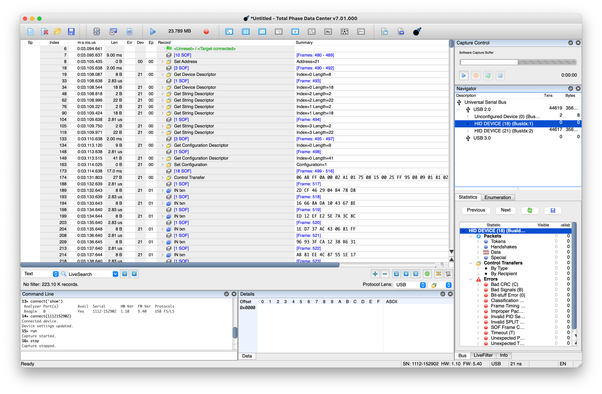

# Legacy Mbed 5.x targets ported to Mbed 6 with USBPhy implemented

# Requirements

* Visual Studio Code
* GCC-ARM compiler installed
* CMake and CMake Tools Extension for Visual Studio Code
* SEGGER J-Link debug probe or OpenOCD with DAPLink compatible debug probe

# How to deploy Mbed

* In a Terminal window

```
$ cd mbed6_custom_targets
$ mbed-tools deploy
```

# How to build for LPCXpresso LPC11U68 board

* Launch Visual Studio Code
* Menu [File] - [Open Workspace from File] : test-hid-lpc11u8/test-hid-lpc11u8.code-workspace
* In a Visual Studio Code Terminal Tab

```
$ ./configure
```
* Select installed GCC Compiler Kit
* Select CMake: [Debug]: Ready
* Build

# How to build and flash for SAMD21 XIAO board

* Launch Visual Studio Code
* Menu [File] - [Open Workspace from File] : test-hid-samd21/test-hid-samd21.code-workspace
* In a Visual Studio Code Terminal Tab

```
$ ./configure
```
* Select installed GCC Compiler Kit
* Select CMake: [Debug]: Ready
* Build
* If a JLink probe connected to the SMD21-XIAO board, Select the Run and Debug "J-Link" from the Run and Debug View 

# Testing USBPhy implementation for SAMD21 and LPC11U68

* Only USB HID class has been tested
* [HIDPyToy](https://github.com/todbot/hidpytoy) can be used to connect to target board and send/receive HID report


* TOTALPHASE Beagle USB 12 Analyzer capture


## Known issues
* None
